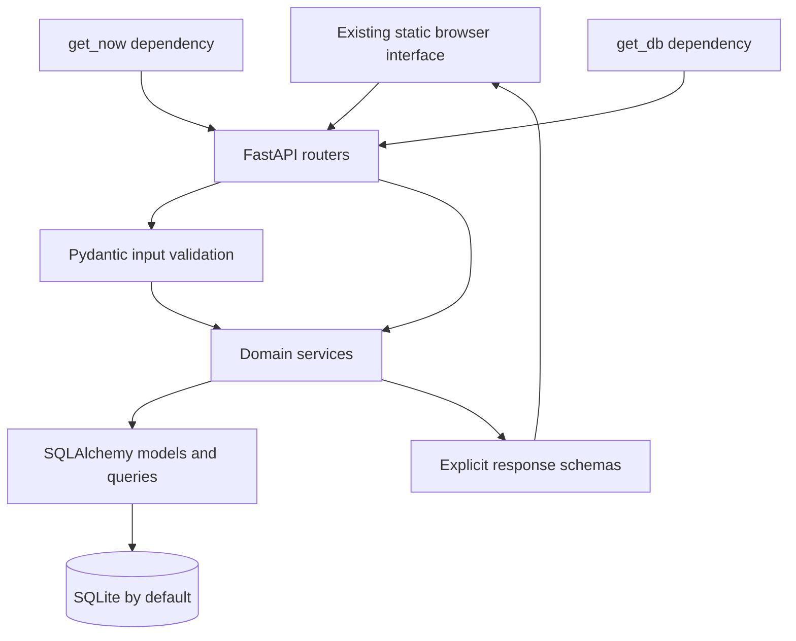
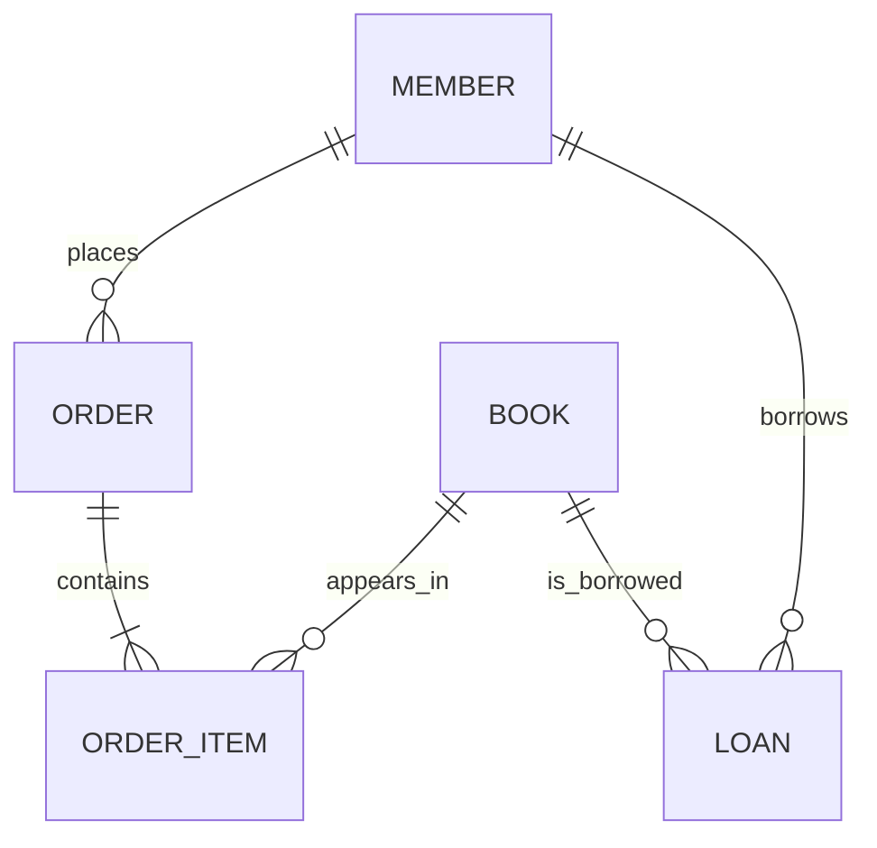

# Sanctum Sanctorum — Architecture and Implementation Plan

Prepared: 22 September 2026.

Status updated 27 September 2026: required local implementation is complete. All 202 supplied acceptance tests and 45 additional checks pass. Browser workflows are verified. Public deployment and GitHub publishing await accounts and destination URLs; see NOTES.md for actual results and limitations.

## 1. Objective and authoritative requirements

Complete the supplied members' bookstore and lending-library backend, make the supplied acceptance tests pass, keep the existing browser interface working, deploy a publicly reachable application, and submit an explainable implementation with meaningful Git history and `NOTES.md`.

Read these project documents alongside this plan:

- [ASSIGNMENT.md](ASSIGNMENT.md): scope and ground rules.
- [SPEC.md](SPEC.md): authoritative API contracts and business rules.
- [INSTRUCTIONS.md](INSTRUCTIONS.md): grading, Git, deployment, AI disclosure, and submission.
- [README.md](README.md): setup and local execution.
- [tests/](tests/): executable acceptance criteria; preserve the supplied files.

If this plan conflicts with the specification, follow the specification and correct the plan. If the specification and a test disagree, document the discrepancy and ask the assignment author or record a reasonable decision; do not change the acceptance test to make it pass.

Time allowance: one week from receipt, approximately 8–15 hours of actual work. The receipt date, rather than archive timestamps, determines the deadline. Architecture is 30% of the grade, code quality 25%, correctness 15%, deployment 10%, Git/process 10%, and communication 10%.

## 2. Repository origin investigation

### Verified local findings before Git initialization

| Item | Finding |
|---|---|
| Project directory | `/home/ybk/Desktop/Sem3/Sanctum Sanctorum main/Sanctum-Sanctorum-main` |
| Original archive | `/home/ybk/Desktop/Sem3/Sanctum Sanctorum main.zip` |
| Project source URL | Not found in project Markdown, code, configuration, or archive contents |
| Lockfile links | Package registry/download links only; no source repository address |
| Git metadata | No usable repository metadata; `git rev-parse --show-toplevel` fails |
| Outer `.git` directory | Empty in the inspected workspace; no `HEAD`, configuration, objects, or history |
| Archive history | No `.git` contents in the ZIP |
| ZIP comment | `923084c6077223fef006d21409c8a6a917c70a43` |
| Download-origin metadata | No origin/download URL found in the archive's available extended attributes |
| Related copies | Only this project and its ZIP found by filename under Desktop and Downloads |
| Starter integrity | Every extracted starter file matches the corresponding ZIP entry byte for byte |

The 40-character hexadecimal archive comment is a possible source commit identifier. Its provenance is not independently verified. The directory name suggests an archive of a `main` branch, but neither clue identifies a repository owner or clone URL. Generic GitHub links in the instructions concern submission and student tools, not this project's origin. Email contents were not inspected.

### Adopted Git workflow and current status

The user confirmed that the submission will use their own public repository and authorized Git initialization in the existing project folder. A local repository now exists inside `Sanctum-Sanctorum-main/`, on branch `main`.

1. Completed: compare all 39 starter files with the supplied ZIP and commit the identical snapshot as `2a07628` — `Import untouched assignment starter from supplied ZIP`.
2. Commit this implementation plan separately from the starter snapshot.
3. Make subsequent implementation commits incrementally, one logical change at a time.
4. When the user's GitHub destination is available, configure that repository as the remote and publish the preserved local history.
5. Record in `NOTES.md`: “The starter was supplied as a ZIP without Git history; the initial commit preserves that supplied snapshot.”

No original clone URL is needed to begin this workflow. The assignment's request to preserve original history cannot literally be met from the supplied ZIP; disclose that limitation rather than claiming the new baseline reconstructs upstream history. No exception from the assignment author has been obtained or implied. If upstream history later becomes available, review it before making any changes to the local history.

Do not guess a GitHub owner from the project name, fabricate prior commits, or mistake the empty outer `.git` directory for the actual repository. The working repository is the inner project directory. No GitHub remote or public repository has been created by the local initialization step.

## 3. Scope and implementation principles

### Required

- All specified book, member, order, loan, statistics, report, and health operations.
- Correct validation and exact error precedence for multi-rule operations.
- Reliable stock accounting and all-or-nothing order creation.
- Existing frontend served at `/`, usable against the completed backend.
- Default SQLite test execution with no external services.
- Public deployment and public source repository.
- Clear decisions, limitations, test results, deployment instructions, and AI disclosure in `NOTES.md`.

### Constraints

- Preserve `tests/`; do not weaken assertions, fixtures, or clock behavior.
- Use the existing dependencies. Do not add frameworks, database drivers, validation packages, or deployment dependencies without resolving the assignment's rule first.
- Retain synchronous FastAPI/SQLAlchemy and Pydantic v2 patterns already used in the project.
- Obtain business time through `Depends(get_now)` at the HTTP boundary and pass `now` into services. Do not use `datetime.now()` inside business logic.
- Represent all money as integer cents and all API datetimes as naive UTC ISO-8601 values.
- Preserve routes, response schemas, `create_app(init_db=...)`, and dependency override support.

### Optional, after required work

- Last-copy concurrency protection and related concurrent request checks.
- A paginated `GET /members` endpoint.
- Additional edge-case tests. The assignment simultaneously prohibits changes anywhere in `tests/` and suggests optional new tests; keep the supplied directory untouched. If needed, place new tests in a separate directory and invoke it explicitly, or clarify the intended exception.

Full authentication, real payment processing, refunds, background jobs, a frontend redesign, microservices, and new product features are outside the requested scope. “Pay” is the specified order-state transition, and member-ID selection is the supplied demonstration identity workflow.

## 4. Target architecture

Use one application with clear module boundaries. The existing structure is sufficient; avoid introducing a generic repository framework or extra abstraction layers.



The diagram shows responsibilities; FastAPI validates request data before invoking the route handler.

| Module | Responsibility | Implementation direction |
|---|---|---|
| `app/main.py` | App factory, lifespan, route wiring, error handler, static mount | Preserve contracts; avoid moving domain rules here |
| `app/db.py` | Engine, base model class, session factory, request session | Keep default SQLite; make driver-specific configuration conditional only if deployment needs it |
| `app/clock.py` | Injectable naive UTC clock | Keep the override point intact |
| `app/models.py` | Persisted domain state and relationships | Complete `Loan`; preserve existing relationships and ordering |
| `app/schemas.py` | Field validation, normalization, request structure, response shapes | Complete ISBN, email, and order-item validation |
| `app/routers/*.py` | Parse HTTP input, inject session/time, call service, return response | Add missing book PATCH route; retain response models/status codes |
| `app/services/books.py` | Catalogue creation, retrieval, updates, queries | Finish validation-related conflicts and catalogue operations |
| `app/services/members.py` | Member creation/retrieval, tier access, orders, statistics | Fix rank comparison, uniqueness, and aggregates |
| `app/services/orders.py` | Price snapshots, discounts, reservations, state transitions | Complete creation and cancellation |
| `app/services/loans.py` | Borrowing policy, due dates, status, returns, fees | Implement all unfinished functions |
| `app/services/reports.py` | Sales aggregates | Implement paid-order bestseller query |
| `app/seed.py` | Demo data on an empty database | Preserve deterministic, valid demo data; verify startup behavior |
| `frontend/` | Existing catalogue, member, cart, order, loan, report interface | Verify integration; change only when needed for contract-compatible behavior |

### Dependency direction

- Routers depend on schemas, services, and dependencies.
- Services use schemas, ORM models, SQLAlchemy, and small domain helpers.
- `members` owns tier comparison and restricted-book access helpers, reused by orders and loans.
- Member statistics should query loan data directly rather than importing the loan service back into `members`; avoid a circular import.
- Read helpers such as `get_book` and `get_member` do not commit.
- Pure calculations such as discount percentage, loan status, and late fees do not touch the database.
- For this project, services may raise `HTTPException`, as explicitly allowed by the specification.

## 5. Data model and invariants



| Entity | Persisted fields and invariants |
|---|---|
| Book | `id`, trimmed `title`, trimmed `author`, unique normalized `isbn`, nonnegative `price_cents`, nonnegative available `stock`, `restricted` |
| Member | `id`, trimmed `name`, unique normalized `email`, valid `tier`, injected `created_at` |
| Order | `id`, `member_id`, `status`, `subtotal_cents`, `discount_percent`, `discount_cents`, `total_cents`, injected `created_at` |
| OrderItem | Internal `id`, `order_id`, `book_id`, positive `quantity`, snapshotted `unit_price_cents`; computed line total |
| Loan | `id`, `member_id`, `book_id`, `borrowed_at`, **add `due_at`**, **add nullable `returned_at`**, **add `late_fee_cents` defaulting to zero** |

Key decisions:

- Available stock is shared by purchases and borrowing. A pending order has already reserved its copies.
- Order prices and discounts are persisted snapshots; later book edits must not rewrite past order totals.
- Loan status is computed at read time, not stored: time passing changes overdue status without a write.
- Returned-loan fees are calculated once on return and persisted. Use the book's price at return time as the cap.
- Order items retain submitted order through their existing relationship ordering by item row ID.
- Book ISBN and member email uniqueness remain backed by database constraints, with meaningful API conflict responses.
- Optional database check constraints may reinforce quantities/prices/stock if they remain simple and portable; they do not replace request validation or error-order rules.
- `create_all` creates missing tables but is not a schema migration strategy. Complete the loan model before relying on a persistent deployment database. If an older database already contains a loan table, explicitly migrate it or recreate only a confirmed disposable demo database; never silently erase stored data.

## 6. API contract inventory

All API routes remain at the root, without an `/api` prefix. Creation returns 201; successful reads, updates, and actions return 200. Validation errors return FastAPI's default 422 format. Domain errors use `{"detail": "..."}`.

| Method and path | Request / query | Success response | Domain failures |
|---|---|---|---|
| `GET /health` | None | `{"status":"ok"}` | — |
| `POST /books` | BookCreate | BookOut, 201 | 409 duplicate ISBN |
| `GET /books` | Search/filter/sort/page parameters | BookPage | — |
| `GET /books/{id}` | Book ID | BookOut | 404 |
| `PATCH /books/{id}` | Partial BookUpdate | BookOut | 404 |
| `POST /members` | MemberCreate | MemberOut, 201 | 409 duplicate email |
| `GET /members/{id}` | Member ID | MemberOut | 404 |
| `GET /members/{id}/orders` | Member ID | OrderOut list, ID ascending | 404 member missing |
| `GET /members/{id}/stats` | Member ID | MemberStats | 404 member missing |
| `GET /members/{id}/loans` | Optional computed status | LoanOut list, ID ascending | 404 member missing |
| `POST /orders` | Member ID and item list | Pending OrderOut, 201 | 404 missing entity; 403 access; 409 stock |
| `GET /orders/{id}` | Order ID | OrderOut | 404 |
| `POST /orders/{id}/pay` | Order ID | Paid OrderOut | 404; 409 invalid state |
| `POST /orders/{id}/cancel` | Order ID | Cancelled OrderOut | 404; 409 invalid state |
| `POST /loans` | Member ID and book ID | LoanOut, 201 | 404; 403 access; 409 borrowing conflict |
| `GET /loans/{id}` | Loan ID | LoanOut | 404 |
| `POST /loans/{id}/return` | Loan ID | Returned LoanOut | 404; 409 already returned |
| `GET /reports/top-books` | `limit`, default 5, range 1–50 | TopBook list | — |

Malformed bodies and invalid constrained query parameters can return 422 in addition to the domain failures above.

### Exact output fields

```text
BookOut = {id, title, author, isbn, price_cents, stock, restricted}
BookPage = {items: [BookOut], total, limit, offset}
MemberOut = {id, name, email, tier, created_at}
OrderItemOut = {book_id, quantity, unit_price_cents, line_total_cents}
OrderOut = {id, member_id, status, items: [OrderItemOut], subtotal_cents,
            discount_percent, discount_cents, total_cents, created_at}
LoanOut = {id, member_id, book_id, borrowed_at, due_at, returned_at,
           late_fee_cents, status}
MemberStats = {member_id, orders_paid, total_spent_cents, active_loans,
               overdue_loans, late_fees_cents}
TopBook = {book_id, title, copies_sold}
```

Use the existing response models to prevent internal fields from leaking. In particular, do not expose an order item's internal row ID. Build `LoanOut` explicitly with the request's `now` to ensure correct computed status.

## 7. Functional implementation details

### 7.1 Books

**Create and validate**

1. Strip title/author first, then enforce lengths 1–200. Preserve acceptance of values that exceed 200 characters before trimming but meet the limit afterward.
2. Require nonnegative price and stock; zero is valid.
3. Remove ASCII hyphens and spaces from ISBN, require 13 decimal digits appropriate to ISBN, and validate the check digit: weight the first 12 digits alternately 1 and 3, then compare the final digit with `(10 - weighted_sum % 10) % 10`.
4. Store and return normalized ISBN digits only.
5. Check uniqueness after normalization; an existing ISBN returns 409. Retain the database unique constraint and roll back failed writes. Map a confirmed uniqueness violation to 409; do not disguise unrelated database errors as duplicates.
6. Default `restricted` to false.

**Read and update**

- Keep `get_book` returning 404 when absent.
- Add the missing PATCH router with `BookUpdate` input and `BookOut` output.
- Apply only fields provided in the request, using `model_dump(exclude_unset=True)` or equivalent.
- Preserve validation of patchable fields and rejection of explicit null values for those fields.
- Silently ignore `isbn` and unknown fields on PATCH, as the contract requires. An empty PATCH is a valid no-op for an existing book.
- Commit the update once; invalid input must leave the book unchanged.

**List and search**

- Combine all supplied filters using AND.
- Within the text filter, match title OR author, case-insensitive substring. Preserve literal substring behavior when input contains SQL wildcard characters.
- `restricted` must distinguish an explicit false from an omitted filter.
- `min_price` and `max_price` are inclusive. Do not treat zero as an absent bound.
- Use one filtered query definition for both count and item selection.
- Compute `total` before offset/limit; return the full matching count even when the requested page is empty.
- Allowed sort values: `title`, `-title`, `price`, `-price`. Always break equal values by ID ascending, including descending primary sorts.
- Omitted sort means ID ascending; explicitly sending `sort=id` is 422.
- Default limit 20, valid range 1–100; default offset 0, minimum 0.
- Do not invent additional price-query validation: reversed bounds naturally return no matches. Mixed-case title ordering is unspecified by the contract.

### 7.2 Members and membership tiers

**Registration**

- Strip name before checking length 1–100.
- Strip and lowercase email before checking `^[^@\s]+@[^@\s]+\.[^@\s]+$`.
- Use the supplied regex rather than introducing an email-validation dependency.
- Default tier to `apprentice`; allow only the four defined tiers.
- Reject duplicate normalized email with 409. Ensure case-insensitive duplicate detection, including existing stored data where relevant.
- Set `created_at` from injected `now` and persist once.

**Tier rules**

| Tier | Rank | Purchase discount | Concurrent unreturned loans | Restricted books |
|---|---:|---:|---:|---|
| apprentice | 0 | 0% | 1 | Denied |
| adept | 1 | 5% | 3 | Denied |
| master | 2 | 10% | 5 | Allowed |
| supreme | 3 | 15% | Unlimited | Allowed |

Fix `tier_at_least` to compare rank with `>=`, not `>`. Use this shared rule for both buying and borrowing. Unlimited borrowing still obeys overdue, duplicate-book, access, and stock checks.

**Reads**

- Missing member returns 404.
- Member orders include pending, paid, and cancelled orders; filter by member and order by ID ascending.
- An existing member with no orders gets an empty list; a missing member does not.

### 7.3 Orders and inventory

**Request validation, before service execution**

- Require a nonempty item list.
- Require every quantity to be at least one.
- Reject duplicate book IDs even if their quantities could be combined.
- These errors are 422 even if the member is missing.

**Creation must run in distinct validation stages**

1. Load member or return 404. Load every referenced book and reject any missing book with 404.
2. Check access to every restricted book; return 403 if any is forbidden.
3. Check stock for every item; return 409 if any quantity is unavailable.
4. Only after all checks pass, decrement all relevant stock and construct the order and items.
5. Snapshot unit prices, calculate totals, set status `pending`, and assign injected `created_at`.
6. Persist stock, order, and items in one transaction.

Do not validate each item all the way through before looking at the next item. A restricted first book and a missing later book must produce 404; a stock shortage and any access violation must produce 403.

**Pricing**

```text
total_quantity = sum(item.quantity)
line_total_cents = snapshotted_unit_price_cents * quantity
subtotal_cents = sum(line_total_cents)
discount_percent = tier_discount + (5 if total_quantity >= 10 else 0)
discount_cents = subtotal_cents * discount_percent // 100
total_cents = subtotal_cents - discount_cents
```

The bulk threshold counts copies across all items, not the number of distinct titles. Discounts add as percentage points. For example, a supreme member buying ten 100-cent copies receives 20%, so subtotal 1000, discount 200, total 800. An adept buying one 999-cent book gets a floored discount of 49 and pays 950. Do not use floating-point money calculations.

**State transitions**

```mermaid
stateDiagram-v2
    [*] --> pending: Create and reserve stock
    pending --> paid: Pay; stock unchanged
    pending --> cancelled: Cancel; restore stock
```



- `pay`: look up order, require pending, set paid, commit once; never decrement stock again.
- `cancel`: look up order, require pending, restore every item's quantity, set cancelled, commit both together.
- All transitions from paid/cancelled, including repeated actions, return 409 and make no changes.
- Missing order returns 404.
- Preserve item submission order and price snapshots in every response.

### 7.4 Loans, due dates, and returns

**Borrow checks, in this exact order**

1. Member exists, then book exists; otherwise 404.
2. Member can access the book; otherwise 403.
3. Member has no overdue unreturned loan; otherwise 409.
4. Member has no unreturned loan of the same book; otherwise 409.
5. Member is below the concurrent unreturned-loan limit, unless unlimited; otherwise 409.
6. Book has available stock; otherwise 409.

On success, set `borrowed_at = now`, `due_at = now + 14 days`, `returned_at = None`, `late_fee_cents = 0`; decrement stock by one and persist loan plus stock together.

**Computed status**

```text
if returned_at is not None: returned
else if now > due_at: overdue
else: active
```

Exactly at the due time the loan remains active, incurs no late fee, and does not block a new loan on overdue grounds. It still counts toward the unreturned-loan limit. Use the same strict comparison in status, borrowing eligibility, and statistics.

**Return workflow**

1. Retrieve loan or return 404.
2. Reject a second return with 409 before changing stock.
3. Calculate the late fee using the current book price and injected return time.
4. Set `returned_at`, persist fee, and restore one copy of stock in the same transaction.
5. Return LoanOut with status `returned`.

**Late fee**

```text
if returned_at <= due_at:
    late_fee_cents = 0
else:
    days_late = ceil((returned_at - due_at) / one_day)
    late_fee_cents = min(days_late * 25, current_book_price_cents)
```

Prefer timedelta division/remainder to implement exact rounding without money floats: divide the positive duration by one day and add one when the remainder is nonzero. One second late counts as one day; exactly one day late costs 25 cents; one day plus one second costs 50 cents, subject to the price cap. A zero-priced book has a zero fee.

**Reads and filtering**

- `get_loan` computes current status using the request clock.
- Member loan listing first verifies the member, filters to that member, then applies optional computed status and orders by ID ascending.
- Query status accepts only `active`, `overdue`, or `returned`; any other value returns 422.
- In this list, `active` excludes overdue loans. In member statistics, `active_loans` includes all unreturned loans, including overdue ones; this distinction is intentional.
- A returned book can be borrowed again when the remaining eligibility checks pass.

### 7.5 Member statistics

Verify member existence before running aggregates. Return integer zeros rather than null sums when there is no matching activity.

| Field | Definition |
|---|---|
| `orders_paid` | Count orders belonging to this member with status paid |
| `total_spent_cents` | Sum persisted `total_cents` over those paid orders |
| `active_loans` | Count this member's loans with no return timestamp |
| `overdue_loans` | Count unreturned loans where `due_at < now` |
| `late_fees_cents` | Sum stored fees for this member's returned loans only |

Use separate order and loan aggregates or isolated subqueries. Joining both one-to-many collections directly can multiply rows and overcount spending, loans, and fees. Avoid calculating an outstanding fee for an unreturned loan; the requested field sums already recorded return fees.

### 7.6 Top-book report

- Join order items to orders and books.
- Include only orders with status paid.
- Group by book ID and current title; sum item quantities as `copies_sold`.
- Exclude zero-sale books, pending orders, and cancelled orders.
- Sort copies descending, then title ascending. Mixed-case title ordering is unspecified; an ID tertiary sort is optional if deterministic complete ties are desirable.
- Apply limit after aggregation and ordering: default 5, accepted range 1–50.
- Return the current book title, not a historical title snapshot.
- Empty sales history returns `[]`.

### 7.7 Startup and HTTP integration

- Preserve `create_app(init_db: bool = True)` and module-level `app = create_app()`.
- With `init_db=True`, lifespan creates tables and seeds only when the database is empty under the existing seed policy.
- With `init_db=False`, application startup must not initialize or seed any database; tests supply their own database and clock.
- Keep CORS allow-all as specified.
- Mount the static frontend after the API routers so it does not intercept API paths.
- Keep the global NotImplementedError-to-501 handler, even after replacing the unfinished service stubs.
- Preserve `/docs` for API inspection and `/health` for a basic availability check.
- Existing seed ISBNs were checked during planning: all 12 have valid checksums. Still verify actual startup and repeat startup during implementation.

## 8. Transaction and error-handling policy

**Planned convention:** the top-level mutating service owns one commit. Lower-level lookup, access, and calculation helpers never commit. Validate before mutation, then save all related changes together. On a write/flush/commit failure, roll back before translating an expected conflict or propagating the exception.

| Operation | Changes that must succeed or fail together |
|---|---|
| Create order | All stock decrements, order row, item rows, and totals |
| Cancel order | All stock restorations and cancellation status |
| Create loan | Stock decrement and loan row |
| Return loan | Stock restoration, return timestamp, and fee |
| Create/update book or member | Entire validated entity change |

SQLAlchemy sessions can start transactions automatically during reads. Do not add `with db.begin()` after lookups have already opened a transaction. Use the existing session's transaction with explicit commit/rollback, or deliberately establish a transaction boundary before the first operation. A failed flush also requires rollback before session reuse. See [SQLAlchemy session and transaction documentation](https://docs.sqlalchemy.org/en/20/orm/session_basics.html).

An atomic transaction prevents partial completion of one operation; it does not by itself prove that two concurrent requests cannot oversell. Required acceptance behavior covers all-or-nothing operations and sequential state transitions. Treat concurrent reservation and duplicate action races as a separate optional hardening task, using a database-appropriate conditional update/locking design and dedicated concurrency checks if attempted. Record any remaining limitations honestly.

## 9. Existing UI workflow and manual acceptance

The frontend is already implemented as static HTML/CSS/JavaScript with relative API requests and local browser state. Prefer serving it from the same origin as the API to preserve these requests without extra deployment configuration.

| User journey | Backend behavior to verify |
|---|---|
| Open catalogue | Seeded books load; no missing-implementation error |
| Search/filter/sort/page | Results and total count agree; changing a filter resets/shows sensible pagination |
| Create/edit a book | Valid values persist; duplicate ISBN and invalid fields show clear errors |
| Create a member or select member ID | Member details load; invalid/missing member is handled |
| Add books to cart and place order | Correct tier/bulk discount; stock reserved; order appears for selected member |
| Pay pending order | Status changes without another stock deduction; stats/report reflect the sale |
| Cancel a separate pending order | Stock restored once; repeated/invalid actions rejected |
| Borrow a book | Loan appears with a 14-day due date; stock reduced |
| Return a book | Returned status and recorded fee shown; stock restored once |
| Switch membership tier via another seeded member | Restricted access and loan limits reflect that member |
| Open reports | Paid-copy counts and ranking match completed purchases |

Use the frozen-clock tests for exact overdue/late-fee boundaries; do not alter production time or wait 14 days to demonstrate them. The seed lists a supreme, master, adept, and apprentice member; verify their actual deployed IDs before writing sign-in instructions rather than assuming IDs forever remain 1–4.

## 10. Verification plan

### Baseline

Run from the project directory containing `pyproject.toml`:

```bash
uv sync
uv run pytest
```

Baseline execution of the untouched import produced 73 passed, 125 failed, and 4 setup errors across 202 cases. The completed implementation passes all 202 supplied cases and 45 additional checks; execution details are recorded in NOTES.md.

### Feature gates

| Work area | Primary acceptance file | Critical checks |
|---|---|---|
| Health and startup | `tests/test_health.py` plus startup/browser smoke | Health response, static UI, no test DB seeding |
| Books | `tests/test_books.py` | Normalization, checksum, duplicates, PATCH, filter/count/order/page correctness |
| Members | `tests/test_members.py` | Registration, email normalization, duplicates, tiers, timestamps; statistics cases depend on later work |
| Orders | `tests/test_orders.py` | Discount boundaries, item ordering, snapshots, validation precedence, atomic stock changes, pay/cancel |
| Loans | `tests/test_loans.py` | Access, limits, overdue boundaries, duplicate borrowing, returns, fee ceiling and cap, filters |
| Statistics | Statistics cases in `tests/test_members.py` | Paid-only totals, unreturned versus overdue, stored fees, missing member |
| Reports | `tests/test_reports.py` | Paid-only quantities, excluded titles, sort ties, limit bounds |

After each feature, run its relevant tests and address failures before the next dependent feature. Intermediate member statistics failures are expected until orders/loans exist; report them rather than claiming the whole member suite passes. Run the full suite at integration milestones and before submission.

Useful commands:

```bash
uv run pytest tests/test_books.py
uv run pytest tests/test_members.py
uv run pytest tests/test_orders.py
uv run pytest tests/test_loans.py
uv run pytest tests/test_reports.py
uv run pytest
uv run uvicorn app.main:app --reload
```

### Additional checks when justified

- Malformed multi-item requests demonstrate the complete 422 → 404 → 403 → 409 precedence, not merely individual failures.
- Order failure involving multiple books leaves all stocks unchanged and creates no order.
- Empty results have stable response shapes and integer zeros.
- Editing a book price changes future orders and the loan-return fee cap, but does not rewrite earlier order prices.
- Report title follows a subsequent book title edit.
- Due time exactly equal to now is treated consistently by status, borrowing, and statistics.
- Repeated cancellation/return cannot increase stock a second time.
- Restarting the app does not duplicate demo data or lose committed data on the chosen deployment.

Add tests only where they establish behavior not already covered, and keep them separate from the supplied `tests/` unless the author clarifies otherwise. Do not add tests that simply mirror the implementation. No new test dependency is needed.

## 11. Deployment decision and workflow

Deployment is required; a perfect local-only solution is incomplete. Start investigating hosting during setup and deploy a partial working application early. The assignment mentions Supabase/Vercel and alternatives, but no provider is required. Provider availability, persistence, and pricing must be verified when selecting the host; this plan does not assume a named free tier includes persistent storage.

### Planned deployment shape

Use a single Python web service that serves both API and the existing static frontend. Keep `SANCTUM_DATABASE_URL` configurable and local tests independent of the deployment database. Choose between these paths after checking the available hosting environment:

| Path | Benefit | Requirement / unresolved issue |
|---|---|---|
| SQLite on durable local storage | Preserves the current dependency set and local behavior | Host must provide a persistent writable volume; use a single application instance initially and document backup/concurrency limits |
| Hosted PostgreSQL | Separates database persistence from the application filesystem | Requires a compatible DBAPI driver absent from current dependencies; resolve the no-new-dependencies rule with the assignment author first |

The starter passes `check_same_thread=False` unconditionally to the engine, so switching the URL alone is insufficient for PostgreSQL. If PostgreSQL is permitted, make SQLite-specific connection arguments conditional, install only the explicitly accepted driver through a reproducible configuration, and keep the SQLite path as the test default. SQLAlchemy documents separate PostgreSQL DBAPI drivers in its [PostgreSQL dialect documentation](https://docs.sqlalchemy.org/en/20/dialects/postgresql.html). Do not silently install a driver only on the host and claim the dependency restriction is met.

### Deployment checklist

1. Select a host/database combination whose persistence and dependency requirements are understood.
2. Finish the loan schema before creating the durable demo database, or have an explicit schema-update plan.
3. Configure a reproducible build from the lockfile using existing project tooling.
4. Run the application with a host-compatible port and interface, e.g. `uv run uvicorn app.main:app --host 0.0.0.0 --port "$PORT"`, with the actual platform's port configuration verified. Do not use `--reload` in the deployed process.
5. Set `SANCTUM_DATABASE_URL` through the host's environment settings. For SQLite, point it to the persistent mounted location; a writable ephemeral directory alone is insufficient.
6. Keep secrets out of the public repository. The current `.gitignore` does **not** ignore `.env` files, despite the submission prose implying secrets are covered. Add appropriate `.env` exclusions before introducing local secret files; commit only a non-secret example if useful.
7. Verify public `/health`, `/docs`, `/`, and the full frontend asset paths.
8. Create a member, place/pay/cancel appropriate orders, borrow/return books, and inspect reports through the deployed interface.
9. Verify persistence across an actual service restart/redeploy appropriate to the host. Do not assume a successful initial request proves durability.
10. Open the public URL in a fresh browser session and record working seeded IDs/instructions in `NOTES.md`.
11. Re-run the default local SQLite test suite after deployment-related edits.

No deployment, account creation, paid service selection, or external publication is performed by this planning task.

## 12. Coding sequence and Git workflow

Aim for small completed increments. The effort allocation below totals approximately 13 hours; adjust within the assignment's 8–15 hour expectation and prioritize required behavior over extras.

| Phase | Approx. effort | Work | Completion evidence / suggested commit |
|---|---:|---|---|
| 0. Establish baseline | 0.75 h | ZIP baseline committed locally; run baseline tests; review hosting constraints | Recorded test baseline and provenance; separate planning commit |
| 1. Books | 1.5 h | ISBN/duplicates, PATCH, query/filter/sort/pagination | Book tests pass; `Complete book validation and catalogue operations` |
| 2. Members | 1 h | Email normalization/uniqueness, tier comparison, member reads | Registration/read tests pass; `Fix member validation and tier access` |
| 3. Orders | 2 h | Input validation, discount calculation, price snapshots, atomic reservation, pay/cancel | Order tests pass; `Implement order pricing and stock reservations`, then a separate cancellation commit if developed separately |
| 4. Loans | 2 h | Finish model, status, eligibility, borrowing, returning, fees, listing | Loan tests pass; split model/borrow/return changes into logical commits as appropriate |
| 5. Statistics/reports | 1 h | Member aggregates and bestselling books | Member/report suites pass; `Add member statistics and paid-sales reports` |
| 6. Integration/deployment | 2.5 h | Full suite, browser smoke, persistence, public URL | Verified deployment and local tests; deployment-specific commit |
| 7. Submission review | 1.25 h | NOTES, clean diff, history, public accessibility, explainability | Final verified checklist and `Document decisions and submission results` |

Investigate and attempt the first deployment during phases 0–2 rather than waiting until phase 6. Complete final deployment verification after integration.

For each increment:

1. Read the relevant specification and supplied tests.
2. Make the smallest cohesive change in the responsible layer.
3. Run the relevant acceptance tests; investigate the cause of failures instead of changing the tests.
4. Review error precedence, state changes, and response shape.
5. Inspect the diff for accidental changes or debug leftovers.
6. Update factual notes and make a meaningful commit in the initialized local repository.

Preserve actual work history. Do not manufacture commits after the fact to imply work was performed in a different sequence, squash everything into one final commit, or commit virtual environments, database files, caches, or secrets.

## 13. Decision log and unresolved questions

| Decision / question | Current position | Next action |
|---|---|---|
| Architecture | Keep one FastAPI application and existing layers | Implement business rules in services and input rules in schemas |
| Database for local work/tests | SQLite as supplied | Preserve independent in-memory tests |
| Transaction ownership | Top-level mutating service commits once | Make stock and domain state atomic; helpers never commit |
| Clock | Inject once per time-dependent request | Pass `now` to services and serializers |
| Loan status | Derived from timestamps at read time | Use strict overdue boundary everywhere |
| Aggregate strategy | Separate collections before combining statistics | Avoid join multiplication |
| Original Git source | Unknown; ZIP contains a possible commit ID; untouched snapshot now committed locally | Document ZIP provenance in NOTES; publish subsequent work to the user's own repository |
| PostgreSQL versus dependency restriction | Unresolved assignment ambiguity | Clarify if a driver is allowed, or choose persistent SQLite hosting |
| Extra tests versus immutable `tests/` | Preserve supplied directory | Use separate optional tests or clarify author intent |
| Concurrent requests | Optional hardening beyond baseline transaction work | Complete required work first and disclose limits |
| Deployment provider | Not selected by this plan | Verify current capabilities and constraints before choosing |

## 14. Final submission definition of done

- [x] All required endpoints implement the specification; no required path still reaches a NotImplementedError stub.
- [x] Validation, error precedence, response fields, price snapshots, stock, and time boundaries pass the verified cases.
- [x] Business logic is in services; routers remain thin; input normalization is in schemas.
- [x] Supplied tests remain unchanged and run locally without external services.
- [x] Actual final test counts, failures, and limitations are recorded honestly.
- [x] Existing web UI starts locally and works against the API.
- [ ] A publicly reachable deployment works in a fresh browser and retains expected data across restarts.
- [ ] The public source repository is accessible while logged out.
- [x] Supplied ZIP snapshot is preserved in the initial commit; absence of upstream Git history is disclosed in NOTES without implying author approval of an exception.
- [x] Commits are incremental and meaningful; no secrets, environments, caches, or database files are committed.
- [ ] `NOTES.md` starts with the live URL and includes verified instructions for using the demo.
- [x] `NOTES.md` explains completed/unfinished work, architecture, trade-offs, ambiguous requirements, testing, and deployment decisions.
- [x] `NOTES.md` has an AI usage section with the actual tools used, what they helped with, and a real reviewed/corrected suggestion; do not invent an anecdote.
- [ ] Every submitted change can be explained in a follow-up discussion.

## 15. Suggested NOTES.md outline

Create this as a separate final record as work progresses; do not use the plan itself as evidence that work has been completed.

```markdown
# Submission notes

Live URL: <verified public application URL>
Repository: <verified public submission repository URL>
Demo access: <verified member IDs and steps>

## Completed functionality
## Incomplete work and known limitations
## Architecture and trade-offs
## Data integrity and time handling
## Testing and verified results
## Deployment and database decisions
## Ambiguities and decisions
## Git provenance
## AI usage
## What I would improve with more time
```

The implementation and local verification are complete. The remaining submission steps are to create the public GitHub destination, deploy using a persistent database volume, verify the public URLs, and record those URLs in NOTES.md.
